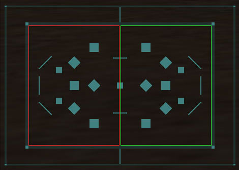
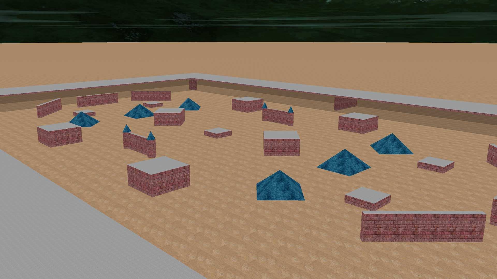
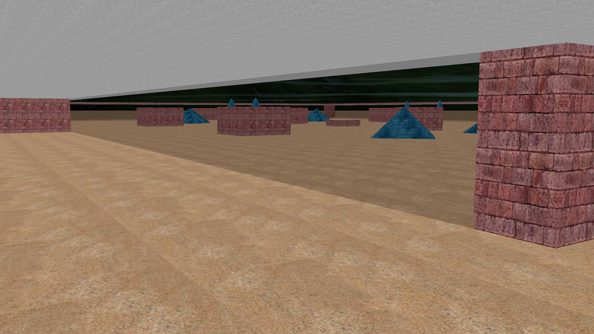

# Dodgeball

[](https://github.com/allejo/dodgeball/releases/latest)

[](LICENSE.md)

Dodgeball is a BZFlag plug-in that introduces a deathmatch-like game mode. Each time a player is killed, they respawn in a "jail" and the only way to escape from jail is to kill an enemy tank while you're in jail. The team that wins the round is the one that manages to place the rest of the entire team in jail.

<table>
    <tr>
        <td colspan="2" align="center">
            
        </td>
    </tr>
    <tr>
        <td>
            
        </td>
        <td>
            
        </td>
    </tr>
</table>

## Requirements

- BZFlag 2.4.14+
- C++11

## Usage

### Loading the plug-in

This plug-in does not take any specifial configuration options at load time.

```
-loadplugin dodgeball
```

### Custom Map Objects

This plug-in introduces the `JAIL` map object which supports the traditional `position`, `size`, and `rotation` attributes for rectangular objects and `position`, `height`, and `radius` for cylindrical objects.

```text
# Rectangle
jail
  position <x> <y> <z>
  size <x> <y> <z>
  rotation <rot>
  color <team>
end
```

```
# Cylinder
jail
  position <x> <y> <z>
  height <height>
  radius <radius>
  team <team>
end
```

- `team` - The team color that will spawn inside of this jail. Supported values:
  - 1 - Red Team
  - 2 - Green Team
  - 3 - Blue Team
  - 4 - Purple Team

## License

- Plug-in: [MIT](LICENSE.md)
- Map: [CC BY-SA 3.0](https://creativecommons.org/licenses/by-sa/3.0/)
